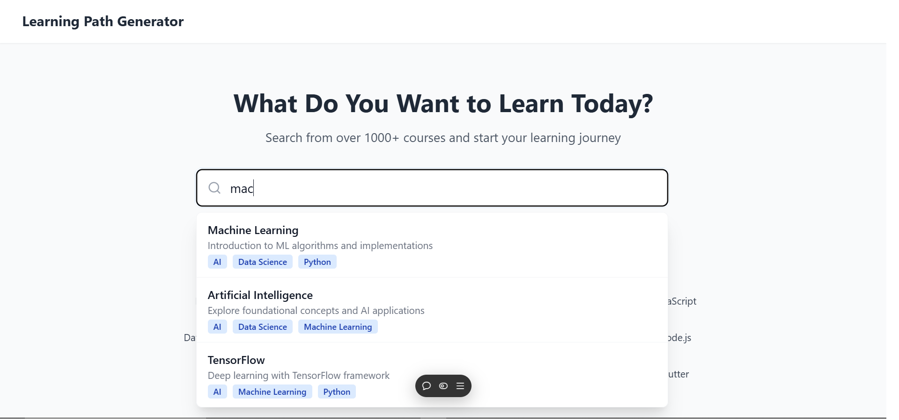
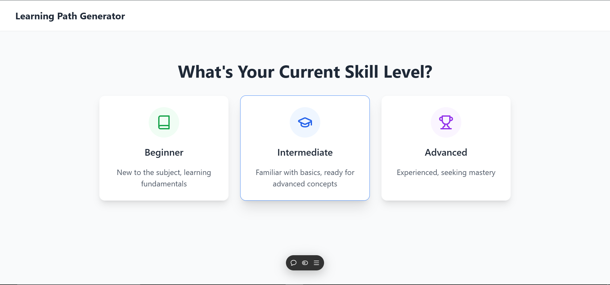
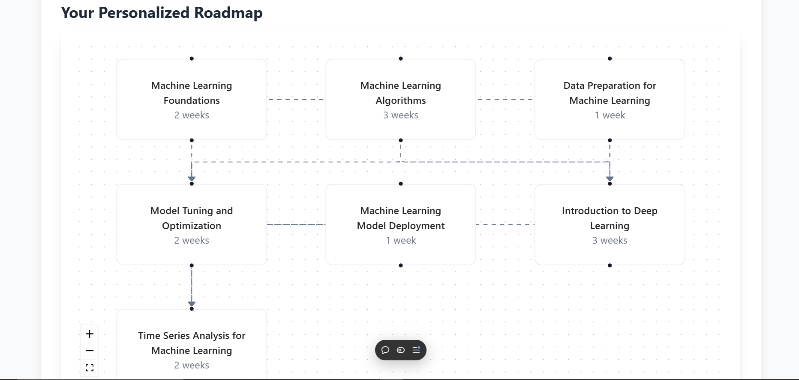

# Personalized Learning Path Generator

## Overview
The Personalized Learning Path Generator is a cutting-edge web application that generates customized learning paths for users based on their skill levels, scores, and preferences. It integrates the Gemini API for dynamic data-driven recommendations and ensures a seamless user experience through a modern, interactive interface.

This project leverages a robust React-based frontend for user interaction and a secure Node.js backend for API processing, providing a highly scalable solution to enhance personalized education.

---

## Key Features

### User-Friendly Input Form
- Allows users to input learning levels, scores, and preferences.
- Provides real-time feedback and validation for accuracy.

### Dynamic Learning Path Generation
- Fetches personalized learning paths using the Gemini API.
- Tailors recommendations based on user-provided data.

### Interactive UI
- Designed with TailwindCSS for responsiveness and aesthetics.
- Intuitive layout for ease of use.

### Backend Processing
- Securely processes and interacts with the Gemini API using Express.js.
- Handles data validation and error management effectively.

### Error Handling
- Displays clear error messages for invalid inputs or API failures.
- Ensures uninterrupted user experience.

---

## Project Demonstration
See it in action!
Watch the demonstration video to explore the features of the Personalized Learning Path Generator in detail:

<section id="demo">
    <a href="https://drive.google.com/file/d/11Y4DIwAtnf9UFJn2p-kRBl05vI0sb0uN/view" target="_blank" rel="noopener noreferrer">Click Here</a>
</section>

## Screens
Screen-01
</img>
Screen-02
</img>
Screen-03
</img>
---

## File Structure
The project is organized as follows:

```
/PersonalizedLearningPathGen
├── .gitignore               # Ignored files for version control
├── eslint.config.js         # ESLint configuration for linting
├── index.html               # Entry HTML file
├── package.json             # Project dependencies
├── tailwind.config.js       # TailwindCSS configuration
├── tsconfig.json            # TypeScript configuration
├── vite.config.ts           # Vite configuration for fast builds
├── /src                     # Source code directory
│   ├── /components          # Reusable React components
│   ├── /data                # Static or dynamic data files
│   ├── /store               # State management files
│   ├── App.tsx              # Main app logic
│   ├── index.css            # Global styles
│   ├── main.tsx             # Entry point for React DOM rendering
│   ├── types.ts             # TypeScript type definitions
│   ├── vite-env.d.ts        # Vite environment configuration
```

---

## Tech Stack

### Frontend
- React (for UI development)
- TailwindCSS (for responsive styling)
- Axios (for API requests)
- Vite (for development and build optimization)

### Backend
- Node.js (for server-side processing)
- Express.js (for API routing)
- Axios (for Gemini API integration)

### API Integration
- Gemini API [for personalized learning path data]

---

## System Requirements

- Node.js: Version 16 or higher
- Package Manager: npm or yarn
- Browser: Latest versions of Chrome, Firefox, or Edge

---

## How to Run Locally

### Clone the Repository
```bash
git clone https://github.com/yourusername/PersonalizedLearningPathGen.git
cd PersonalizedLearningPathGen
```

### Install Dependencies
```bash
npm install
```

### Run the Development Server
```bash
npm run dev
```

### Access the Application
Open `http://localhost:3000` in your browser.

---

## API Details

The project uses the Gemini API to fetch personalized learning paths. Below are the integration details:

### API Endpoint
`https://api.gemini.com/v1/learning-path`

### Request Payload Example
```json
{
    "userLevel": "beginner",
    "scores": {
        "math": 85,
        "science": 90
    },
    "preferences": ["videos", "quizzes"]
}
```

### Sample Response
```json
{
    "path": [
        {"module": "Algebra Basics", "resource": "https://algebra.com"},
        {"module": "Physics Introduction", "resource": "https://physics.com"}
    ]
}
```

---

## Deployment

The project is deployed on GitHub Pages. To update the deployment:

### Build the Project
```bash
npm run build
```

### Deploy the Build
```bash
npm run deploy
```

---

## Future Enhancements

1. Add support for localization and multi-language interfaces.
2. Implement offline caching for uninterrupted use.
3. Enhance UI with advanced animations and transitions.
4. Integrate additional APIs for broader learning resource suggestions.

---

## Acknowledgments

Special thanks to the Gemini API team for providing robust and reliable resources for this project.

---


